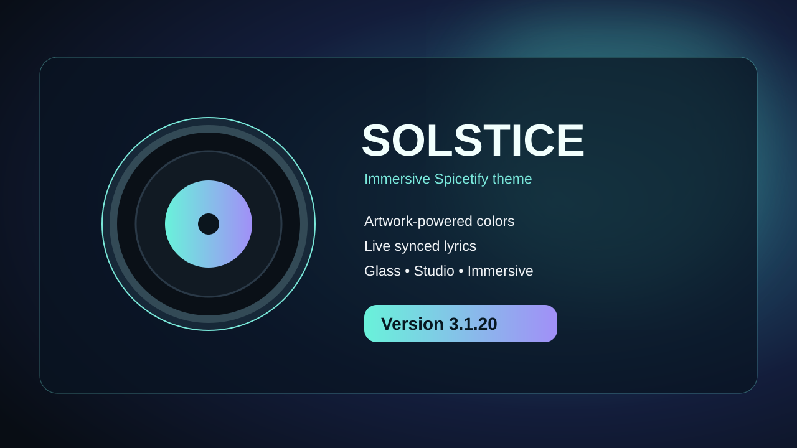

# ☀️ Solstice

### Your music. In full color.

**Solstice 3.1.20** is an immersive Spicetify theme featuring artwork-driven colors, glass interfaces, synchronized lyrics, and a customizable player. Made by Crystal.

**🌐 [Official website](https://y2kbeatzz-dot.github.io/Solstice/)** · **[Preview](preview-v3.1.20.svg)** · **[Report an issue](https://github.com/y2kbeatzz-dot/Solstice/issues)**

**⭐ [Please star this repository to help support Solstice!](https://github.com/y2kbeatzz-dot/Solstice)**

**3.1.20 fix:** The turntable now has visible black vinyl grooves, a smaller circular album-art center label, a properly mounted tonearm, and record rotation that follows your mouse as you drag it. Clockwise/anticlockwise seeking and ±10-second buttons remain.

## Features

- **Artwork-powered colors** — accents and lighting respond to the album cover.
- **Synchronized lyrics** — sidebar, floating lyrics, and immersive lyric views with a built-in editor.
- **Immersive Mode** — a fullscreen player with visualizer, artwork, karaoke, and a playable vinyl turntable with forward/reverse scrubbing and a tonearm.
- **Solstice Studio** — appearance, blur, glass, motion, and accessibility controls.
- **Solstice Updater** — an in-theme Studio tab that checks the latest public release, opens Marketplace, and backs up/restores Studio settings and edited lyrics.
- **Lightweight playback updates** — shared lyric timing and cached rendering.

## Version 3.1.20

Adds an **interactive vinyl deck** to Immersive Mode: drag the record clockwise to advance or counterclockwise to rewind, lift/drop the tonearm to pause/play, and use ±10-second buttons. Supports keyboard seeking and preserves Studio preferences, saved lyrics, and all previous visual features. The Studio Updater, saved settings and lyrics, immersive effects, and all previous features remain.

Built for the Spicetify community. Not affiliated with Spotify or Spicetify.
